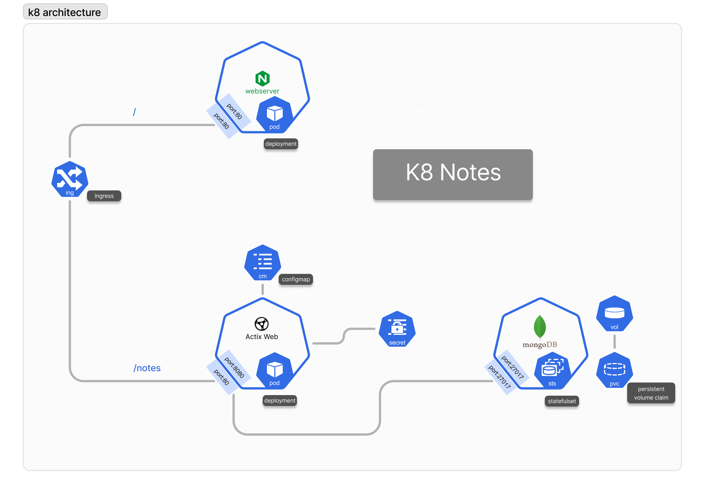

# K8Notes

---

What better way to learn a technology than to create an app with it? The theory all makes sense when you actually put it into practice. To get familiar with Kubernetes basics, we will create a minimalistic application with an emphasis on learning Kubernetes. The outcomes of this project are:

1. **Better understanding and familiarity with Kubernetes basic concepts:**
   - Networking: Ingress & Service
   - ConfigMaps & Secrets
   - StatefulSets & VolumeClaims
   - kubectl & minikube
2. **Learning a Rust framework along the way**

---

This is a very basic app that stores k8 notes with useful information to memorize about Kubernetes!

## Tech Stack

To build the application, we will use the following tech stack:

1. **Kubernetes** - Obviously
2. **Docker & DockerHub** - For our container images
3. **Nginx** - For our web server and our ingress
4. **Actix** - A Rust framework and the Rust MongoDB driver
5. **Git** - For version control
6. **MongoDB** - For our database
7. **Optional:** WSL, Linux subsystem for Windows

---

## Workflow and Tasks

### Task 1: Pre Reqs

[Steps](https://www.notion.so/Steps-ddc533fc983044218df281ede95b6771?pvs=21)

- [x] Create ConfigMap and Secret
- [x] Create DockerHub repo

### Task 2: Create Actix App

[Steps](https://www.notion.so/Steps-85d6146ee0ae4e889aeabbdb786bbdbf?pvs=21)

- [x] Build Rust app with Cargo
- [x] Make custom image for the app
- [x] Push to DockerHub
- [x] Deploy to k8 and test endpoint with minikube service

### Task 3: Create MongoDB

[Steps](https://www.notion.so/Steps-53623d152a41440faf6688e046c82f60?pvs=21)

- [x] Deploy MongoDB with persistent volume
- [x] Test Actix app integration with MongoDB

### Task 4: Configure Ingress

[Steps](https://www.notion.so/Steps-6e9f4f400d4447c2a6dd2be114bab496?pvs=21)

- [x] Create ingress for Actix app and test

### Task 5: Create Web Server

[Steps](https://www.notion.so/Steps-9454d0d1e65241d08d0bb6b1d3512372?pvs=21)

- [x] Make custom image for Nginx web server
- [x] Push to DockerHub
- [x] Deploy to k8 and test with minikube service

### Task 6: Final Integration

[Steps](https://www.notion.so/Steps-df8775ccaf21446cb93dff0638030707?pvs=21)

- [x] Add web service to ingress
- [x] Test the entire application

---
